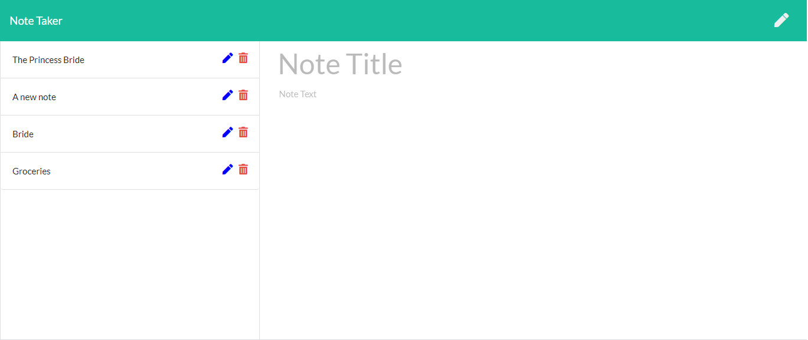
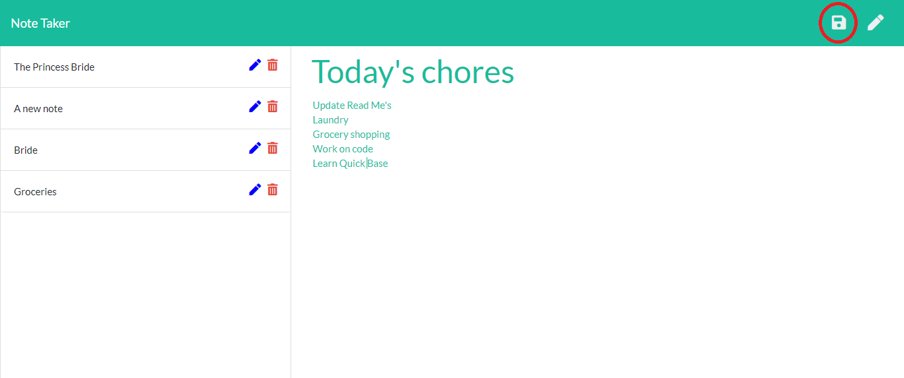

# Note Taker
Deployed app: https://polar-dawn-99284.herokuapp.com

Github pages:  https://github.com/MauraSlavin/notetaker

## Description

Notetaker creates, saves, edits, and deletes notes. It uses express backend to read, write, and delete to and from a JSON file.
 
The application frontend was created, I built the backend and connected the two.  I also added icons and functionality to edit notes.

## Technologies and tools used

- Express
- npm fs package
- jQuery
- Bootstrap
- Javascript
- node js
- html
- css
- fontawesome

## Problem solved

A tool to keep track of a lot of information in one easily accessible place in a simple user-friendly format to keep organized.

## Instructions

Visit https://polar-dawn-99284.herokuapp.com.  This is the home page:

.

Click on "Get Started" to work with the notes.

The next screen looks like this:

.

Notes previously stored, along with icons to edit or delete, are displayed on the left.
A place to create a new note is to the right.

### Messages

A message is displayed when a note is saved or deleted.  Examples:

  

### To create a new note

If "Note Title" is displayed in gray, you may begin typing the title and text of your note.
Otherwise, click on the pencil icon on the top right to start a new note.
When you start typing a new note, it will appear in teal.

When a title and some text is entered, a save icon will appear in the top right:

When you click on the save icon, the list is saved, and appears at the bottom of the list of notes on the left.

"Note Title" is displayed in gray, indicating that a new note can be created.
Note that the text turned teal when you are creating or updating a note.

### To display a note

Click on the title of a note to display it (without the ability to edit it).  Let's see the before and after screens for displaying the "Groceries" list:

then...

The "Groceries" note is in black, indicating that it cannot be editted.  You cannot change the title or text, and the save icon will not appear.

### To edit a note

Click on the pencil icon to the right of a note to enable editting of that note.  Let's edit the "Groceries" note:

The "Groceries" note is displayed in teal, indicating that it is edittable.  The save icon appears on the top right of the screen.

Let's change bananas to pasta, and save the changed list:

After the new "Groceries" note is saved, the screen looks like this:

Note that "Groceries" is now at the bottom of this list.

### To delete a note

Simply click on the trash can (delete) icon next to the note you want to delete.  Let's delete the "Groceries" note:

After the "Groceries" note is deleted, it no longer appears in the list on the screen:

